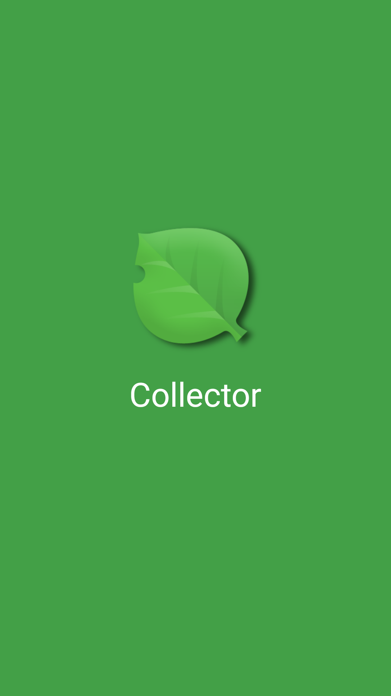
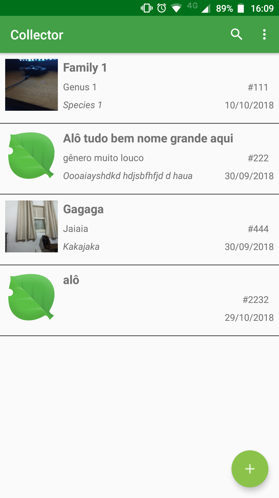
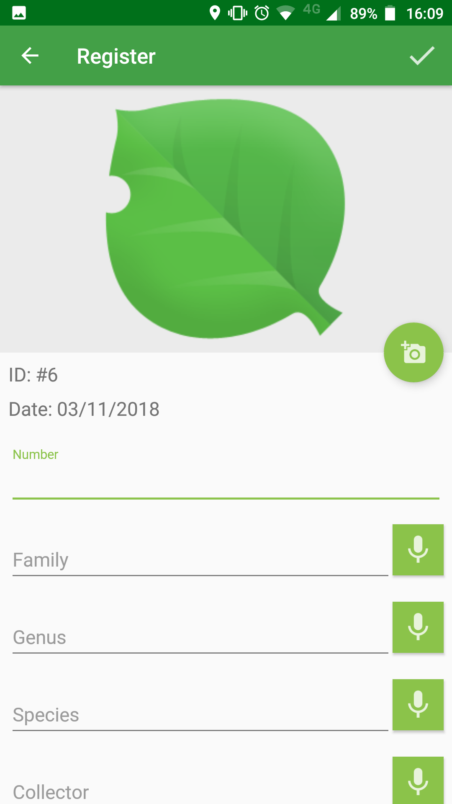
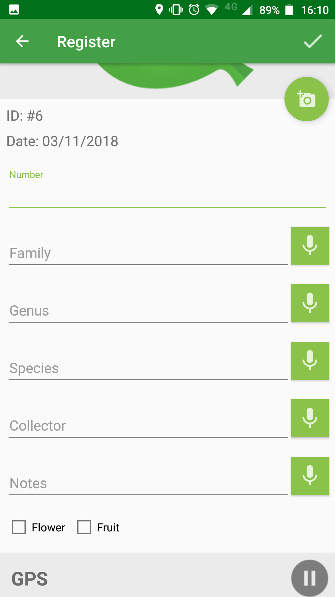
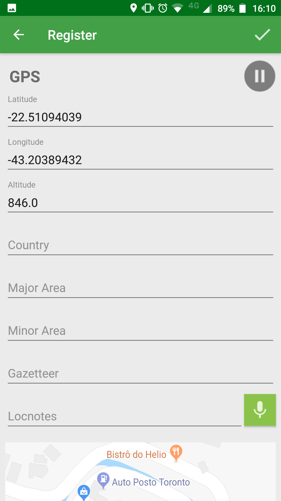
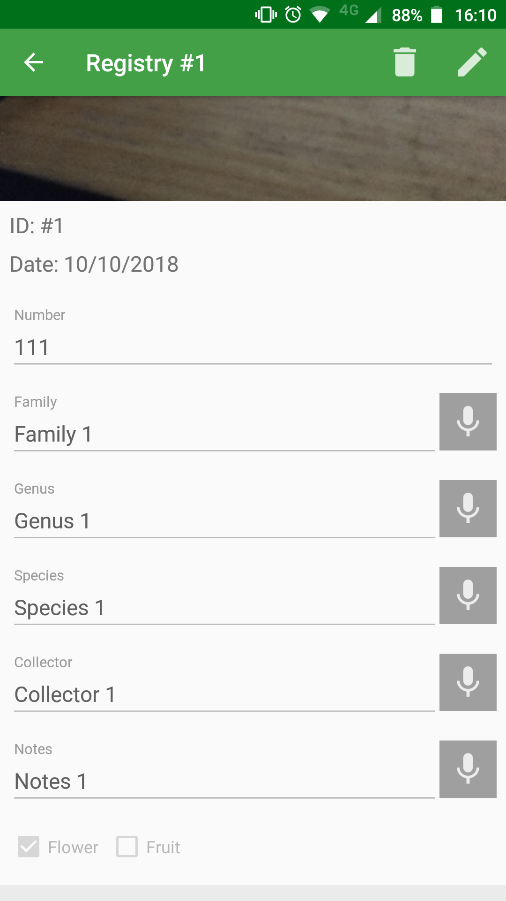
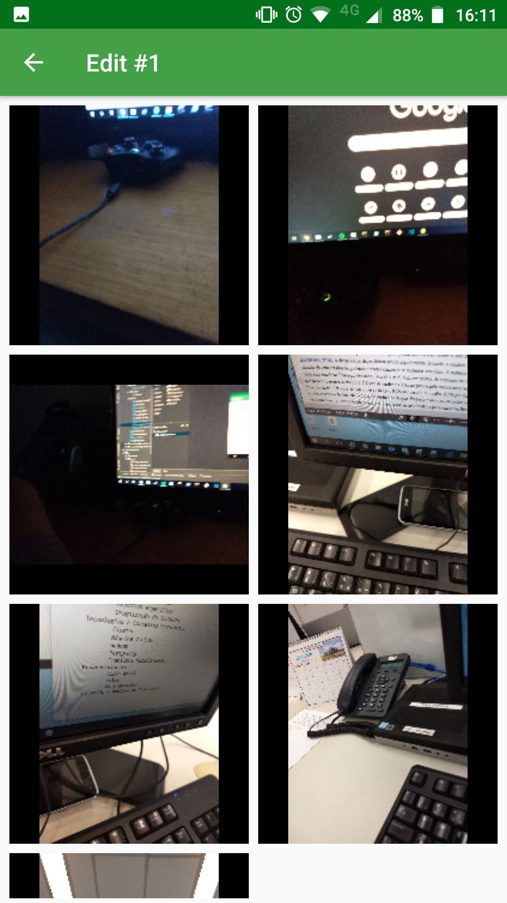

# collector

Aplicativo Android para Coletas Botânicas.

Monografia desenvolvida durante a disciplina de Projeto Final de Curso apresentada ao Centro de Engenharia e Computação da Universidade Católica de Petrópolis, como pré-requisito para a obtenção do título de Bacharel em Engenharia de Computação.

## Objetivo

O objetivo principal é o desenvolvimento de um aplicativo para ser utilizado por botânicos nas coletas realizadas em excursões. Auxiliando e facilitando na coleta de informações das amostras.

## Projeto

 
 
 
 

### Telas

 
 
 
 

## Contextualização

A área da botânica realiza diversos tipos de pesquisas que necessitam de amostras de exemplares.

Para se ter essas amostras, os pesquisadores têm que ir no campo, coletar, identificar e transportá-las para posterior preparo e armazenamento em um herbário.

No campo, os pesquisadores muitas vezes enfrentam condições adversas de trabalho pois é um ambiente hostil.

A principal preocupação é realizar o máximo de coletas e registro de informações em um espaço curto de tempo para aproveitar a excursão, que tem altos custos.

Os coletores registram, em cadernos de coletas, os dados das amostras coletadas.

O fato de utilizarem cadernos acarreta em uma perda de tempo, impactando na quantidade total de amostras coletadas e também nos detalhes coletados.

Os pesquisadores organizam o material coletado na forma de uma coleção científica de plantas secas (desidratadas) e prensadas, denominadas exsicatas.

As exsicatas podem permanecer por centenas de anos servindo para identificação de espécies de plantas, ou como fonte de estudos para diversas áreas, como a taxonomia e a ecologia.

São consideradas como testemunhos da ocorrência das espécies na natureza.

Ao redor do mundo, existem aproximadamente 3.400 herbários registrados no Index Herbariorum.

Totalizando, em seus acervos, cerca de 350 milhões de espécimes preservados.

Os herbários são instituições antigas, no mundo, temos como exemplo o Museu de História Natural da França (1793).

Na América Latina, o Herbário Nacional do México (1888) é o maior.

No Brasil, destaca-se o herbário do Instituto de Pesquisas Jardim Botânico do Rio de Janeiro (1808).
